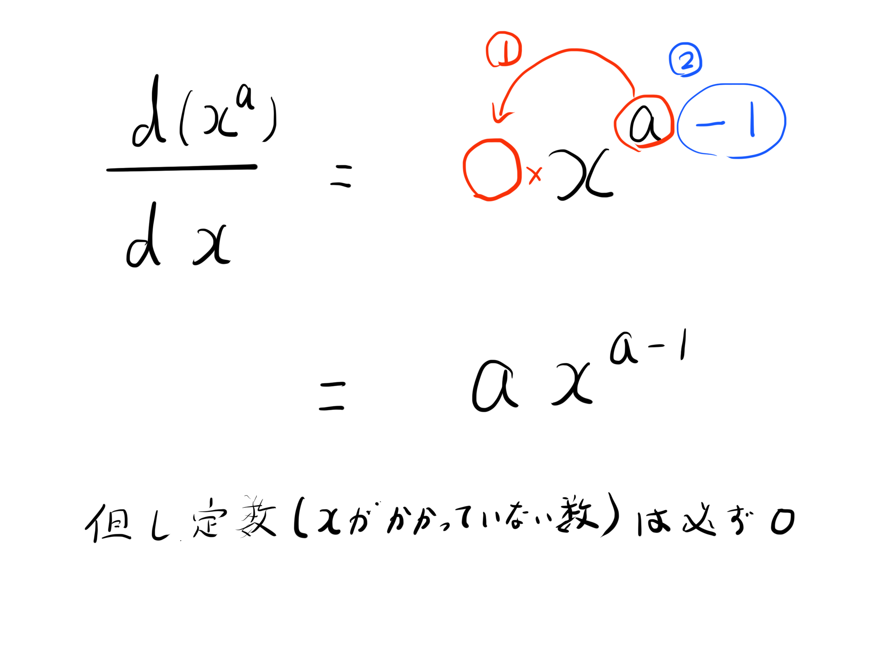

# 20210530解答

初歩の微分は次のように計算できます。

ただし、この方法でできないものもありますが、統計検定2級であればこの計算でできるものしか出ないでしょう。

### 次の関数を $x$ に関して微分しましょう。

1. $f(x) = 2x + 3$

$$
\begin{aligned}
\frac{d(2x + 3)}{dx} &= 1 \times 2x^{(1-1)} + 0\\
                     &= 2
\end{aligned}
$$
2. $f(x) = 4$

$$
\begin{aligned}
\frac{d(4)}{dx} = 0
\end{aligned}
$$

3. $f(x) = 4x^2 + 10$

$$
\begin{aligned}
\frac{d(4x^2 + 10)}{dx} &= 2 \times 4x^{(2-1)}\\
                        &= 8x
\end{aligned}
$$

4. $f(x) = x^2 + 3x + 4$
$$
\begin{aligned}
\frac{d(x^2 + 3x + 4)}{dx} &= 2 \times x^{(2-1)} + 1 \times 3x^{(1-1)}\\
                        &= 2x + 3
\end{aligned}
$$

5. $g(x) = (x + 3)(x + 4)$
$$
\begin{aligned}
\frac{d((x + 3)(x + 4))}{dx} &= \frac{d(x^2 + 7x + 12)}{dx}\\
&= 2 \times x^{(2-1)} + 1 \times 7x^{(1-1)}\\
&= 2x + 7
\end{aligned}
$$

### 次の関数のある点の接線の傾きを求めましょう。

1. $f(x) = 2 x + 3$ の $ x = 3$ における接線の傾き

$$
\begin{aligned}
f'(x) = \frac{d(2x+3)}{dx} &= 1 \times 2x^{(1-1)}\\
    &= 2
\end{aligned}
$$

で、
$$f'(3) = 2$$

であるから、$x=3$ における傾きは $3$。

**注意** $f(x) = ax + b$ のように直線の場合、どの$x$の点に関しても接線の傾きは$f(x)$の傾きである$a$です。理由を考えてみてください。（ヒント: 微分は平均変化率を1点に近づけたものです。）

2. $f(x) = 3 x^2 + 2x + 1$ の $ x = 1$ における接線の傾き

$$
\begin{aligned}
f'(x) = \frac{d(3x^2 + 2x + 1)}{dx} &= 2 \times 3x^{(2-1)} + 1 \times 2x^{(1-1)}\\
    &= 6x + 2
\end{aligned}
$$

で、
$$f'(1) = 8$$

であるから、$x=1$ における傾きは $8$。

3. $f(x) = x^3 + 2x^2 + x + 4$ の $x = 0$ における接線の傾き

$$
\begin{aligned}
f'(x) = \frac{d(x^3 + 2x^2 + x + 4)}{dx} &= 3 \times x^{(3-1)} + 2 \times 2x^{(2-1)} + 1 \times x^{(1-1)}\\
    &= 3x^2 + 4x + 1
\end{aligned}
$$

で、
$$f'(0) = 1$$

であるから、$x=0$ における傾きは $1$。

### 次の問題を解きましょう（やや応用）

$f(x) = x^2 + 2x + 1$ の $x = 2$ における接線の関数を式で表してください。

$$
\begin{aligned}
f'(x) = \frac{d(x^2 + 2x + 1)}{dx} &= 2 \times x^{(2-1)} + 1 \times 2x^{(1-1)}\\
    &= 2x + 2
\end{aligned}
$$

で

$$f'(2) = 6$$

であるから、$x=2$における接線の傾きは $6$。ここで、$f(x)$ と接線が接触する点を$(a,b)$ とすると、その接線は

$$y - b = f'(a)(x - a)$$

の形をしている。ここで、$f(x)$ の$x=2$ における$y$ 座標は、

$$f(2) = 2^2 + 2 \times 2 + 1 = 9$$

であるから、$f(x)$ と接線が接触する点の座標は$(2, 9)$。これを接線の式に代入すると、

$$
\begin{aligned}
y - 9 &= 6(x - 2)\\
y &= 6x - 3
\end{aligned}
$$

である。

### 次の問題を解きましょう（文章題）

ある商品を定価で売ると原価の 25%の利益が出ます。セールで定価の 10%引きで売ったため、利益は 125 円でした。この商品の原価を答えてください。

最終的に求めたいものを $x$ として、$x$ を使って現在わかるものを式で表していくのがコツです。

$x$ を原価とする。まだ定価と利益は不明であるが、利益の計算は
**利益 = 定価 - 原価** で計算できる。つまり、**定価 = 利益 + 原価** である。ここで、「定価で売ると原価の 25%の利益」であるから、利益は $0.25 x$（原価の25%=0.25）。よって定価は、

$$
\begin{aligned}
定価 &= 0.25 x + x\\
     &= 1.25 x
\end{aligned}
$$
である。

セールで定価の10%引きで販売したから、実売価格は

$$
\begin{aligned}
実売価格 &= 定価 * (1-0.1)\\
     &= 1.25 x * 0.9\\
     &= 1.125x
\end{aligned}
$$
である。実利益は 125円 であるが、一方で実利益の計算は

$$
\begin{aligned}
実利益 &= 実売価格 - 原価\\
     &= 1.125 x - x\\
     &= 0.125x
\end{aligned}
$$

である。以上より、

$$
\begin{aligned}
125 &= 0.125x\\
x   &= 1000
\end{aligned}
$$

であるから、原価は 1000円 である。

