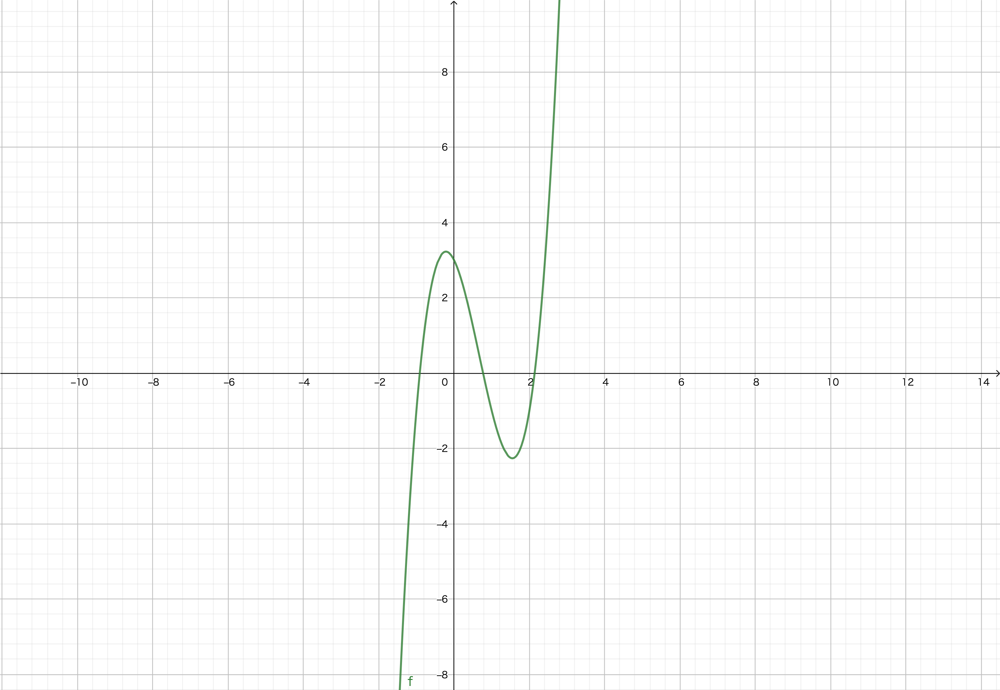

# 20210531練習問題

## 次の図の平均変化率を考えましょう

上のグラフは $y=f(x)=2x^3-4x^2-2x+3$ のグラフです.

1. $x=-1$ と $x=3$ のときの$f(x)$ の$y$座標を求めてください.
2. $(x_1, y_1)$と$(x_2, y_2)$のときの平均変化率は

$$平均変化率=\frac{y_2 - y_1}{x_2 - x_1}$$

で求めることができます.
$x=-1$ と $x=3$ のときの$f(x)$ の平均変化率を求めてください.
3. $x=0$ と $x=3$ のときの$f(x)$の平均変化率を求めてください.
4. $x=-2$ と $x=2$ のときの$f(x)$の$y$座標を求めてください.
5. $x=-2$ と $x=2$ のときの$f(x)$の平均変化率を求めてください.
6. $(a_1, b_1)$と$(a_2, b_2)$を通るときの$f(x)$を通る直線は,

$$y-b_1 = \frac{b_2 - b_1}{a_2 - a_1}(x - a_1)$$

もしくは

$$y-b_2 = \frac{b_2 - b_1}{a_2 - a_1}(x - a_2)$$

で求めることができます.平均変化率を$\alpha$とすると,

$$y-b_i = \alpha(x - a_i)\qquad(i=1, 2)$$

です.$x=-2$ と $x=2$のときの$f(x)$の座標を通る直線の関数の式を求めてください.

7. $f(x)$を微分すると,ある1点における接線の傾きを求めることができます.$f(x)$を微分して$f'(x)\quad(\frac{df(x)}{dx}のこと)$ を求めてください.

8. $x=-2$ と $x=-2$ における$f(x)$の接線の傾きを求めてください.

9. $x=a$ における$f(x)$の接線の関数は,

$y - f(a) = f'(a)(x-a)$

で求めることができます.$x=2$と$x=-2$の接線の関数を求めてください.
