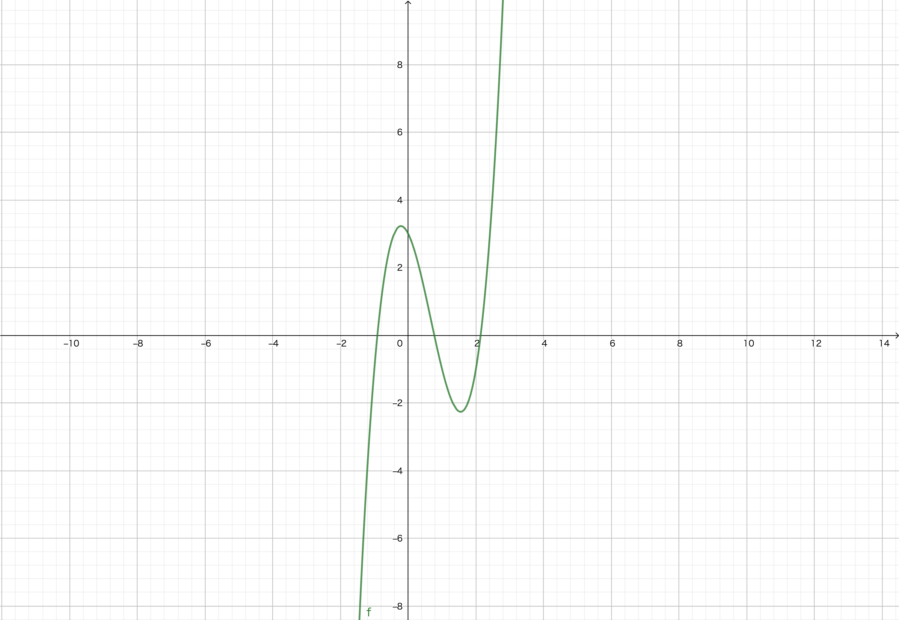

# 20210531 練習問題解答

## 次の図の平均変化率を考えましょう

上のグラフは $y=f(x)=2x^3-4x^2-2x+3$ のグラフです.

#### 1. $x=-1$ と $x=3$ のときの$f(x)$ の$y$座標を求めてください.

$x=-1$ と $x=3$ のときの $f(x)$の$y$座標は,$x$に代入することで求めることができます.

$$
\begin{aligned}
f(-1) &= 2 \times (-1)^3 - 4 \times (-1)^2 - 2 \times (-1) + 3\\
     &= -1
f(3) &= 2 \times 3^3 - 4 \times 3^2 - 2 \times 3 + 3\\
     &= 15
\end{aligned}
$$

#### 2. $(x_1, y_1)$と$(x_2, y_2)$のときの平均変化率は

$$平均変化率=\frac{y_2 - y_1}{x_2 - x_1}$$

####で求めることができます.
#### $x=-1$ と $x=3$ のときの$f(x)$ の平均変化率を求めてください.

1.より $f(x)$ は$(-1, -1)$ と$(3, 15)$ を通ることがわかります.
平均変化率の求め方より,

$$\frac{15 - (-1)}{3 - (-1)} = 4$$

#### 3. $x=0$ と $x=3$ のときの$f(x)$の平均変化率を求めてください.

$$f(0) = 3$$

より,$f(x)$ は $(0, 3)$を通ります.$x=3$のときは$y=15$であったため,平均変化率は,

$$\frac{15 - 3}{3 - 0} = 4$$

ちなみに, 2. と  3. で平均変化率が一致したのはたまたまです.

#### 4. $x=-2$ と $x=2$ のときの$f(x)$の$y$座標を求めてください.

1.と同様に,$f(x)$に代入して求めましょう.

$$
\begin{aligned}
f(-2) &= 2 \times (-2)^3 -4 \times (-2)^2 - 2 \times -2 + 3\\
      &= -25\\
f(2) &= 2 \times (2)^3 -4 \times (2)^2 - 2 \times 2 + 3\\
&= -1
\end{aligned}
$$

#### 5. $x=-2$ と $x=2$ のときの$f(x)$の平均変化率を求めてください.

4.より平均変化率は,

$$
\begin{aligned}
\frac{-1 - (-25)}{2 - (-2)} = 6
\end{aligned}
$$

#### 6. $(a_1, b_1)$と$(a_2, b_2)$を通るときの$f(x)$を通る直線は,

$$y-b_1 = \frac{b_2 - b_1}{a_2 - a_1}(x - a_1)$$

#### もしくは

$$y-b_2 = \frac{b_2 - b_1}{a_2 - a_1}(x - a_2)$$

#### で求めることができます.平均変化率を$\alpha$とすると,

$$y-b_i = \alpha(x - a_i)\qquad(i=1, 2)$$

#### です.$x=-2$ と $x=2$のときの$f(x)$の座標を通る直線の関数の式を求めてください.

5.より$f(x)$の$(-2, -25)$と$(2, -1)$における平均変化率は,6.よって

$$
\begin{aligned}
y - (-1) &= 6(x - 2)\\
       y &= 6x -12 - 1
       y &= 6x - 13
\end{aligned}
$$

実際に直線の関数があっているかは,$x=-2$ もしくは $x=2$を代入して$y$座標と一致しているかで確認することができます.

#### 7. $f(x)$を微分すると,ある 1 点における接線の傾きを求めることができます.$f(x)$を微分して$f'(x)\quad(\frac{df(x)}{dx}のこと)$ を求めてください.

$f(x)$ を$x$ に関して微分すると

$$
\begin{aligned}
f'(x) &= 3 \times 2 x^{(3-1)} + 2 \times -4x^{(2-1)} + 1 \times -2x^{(1-1)}\\
      &= 6x^2 -8x - 2
\end{aligned}
$$

#### 8. $x=-2$ と $x=2$ における$f(x)$の接線の傾きを求めてください.

7.で求めた導関数に$x=-2$,$x=2$ をそれぞれ代入すると,

$$
\begin{aligned}
f'(-2) &= 6 \times (-2)^2 -8 \times (-2) -2\\
       &= 38\\
f'(2) &= 6 \times 2^2 - 8 \times 2 -2\\
      &= 6\\
\end{aligned}
$$

#### 9. $x=a$ における$f(x)$の接線の関数は,

$$y - f(a) = f'(a)(x-a)$$

#### で求めることができます.$x=2$と$x=-2$の接線の関数を求めてください.

8. より $x=-2$ と $x=-2$のときの$f(x)$の$y$座標はそれぞれ$-25,-1$ である.また, 8.より$x=-2$ と $x=-2$のときの$f(x)$の接線の傾きはそれぞれ$38, 6$ である。よって$x=-2$の場合は

$$
\begin{aligned}
y - (-25) &= 38(x - (-2))\\
       y  &= 38 x + 72 - 25\\
       y &= 38x + 47\\
\end{aligned}
$$

であり、$x=2$の場合は、

$$
\begin{aligned}
y - (-1) &= 6(x - 2))\\
       y  &= 6x - 12 -1\\
       y &= 6x - 13\\
\end{aligned}
$$
