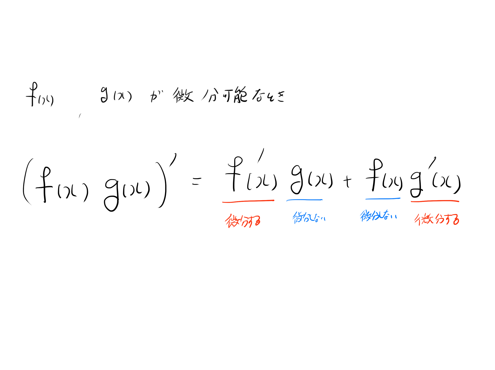

# 20210601練習問題

1. $f(x) = x^2 + 2x + 1$を$x$に関して微分してください.
2. $g(x) = x^3 + y + 1$を$x$に関して微分してください.（ヒント: $x$ に関して微分するときは$x$ 以外の変数は定数と見なします.）
1. $(x^2 + 2x + 1)(x^3 + y + 1)$ を$x$に関して微分してください.
4. $(x - 3)(x + 5)$ を$x$に関して微分してください.
5. $(x - 4)(x + 4)$ を$x$に関して微分してください.
6. $(x -3)(x + 5)(x - 4)(x + 4)$ を$x$に関して微分してください.
