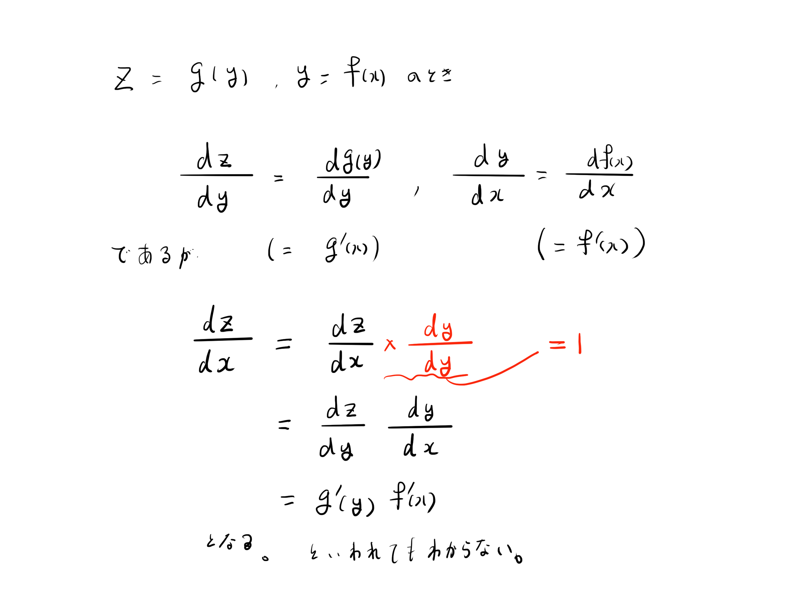
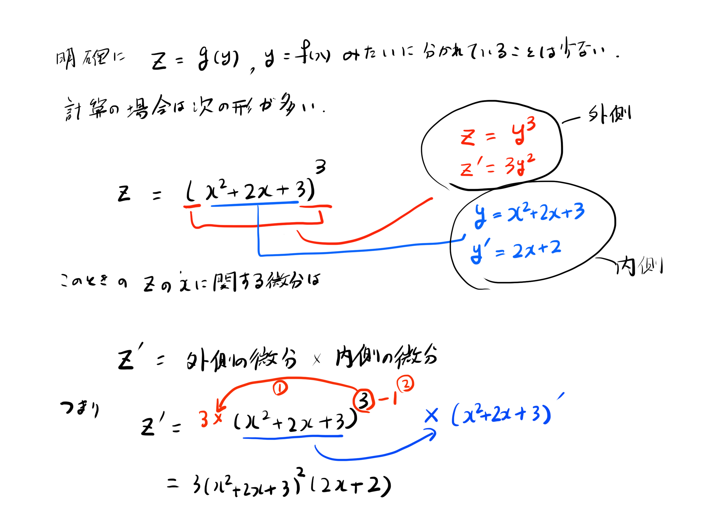

# 20210602練習問題

## 合成関数の微分法

合成関数の微分法はよく使いますが、本などで説明されるようなきれいな形で出てくることはあまりありません。一応、本の解説のような雑な説明をします。

よくあるものは、$(\circ\circ\circ)^\alpha$ ($\alpha$は$0$以外の実数) のような形であったり、$\log_e(\circ\circ\circ)$ や $\sin(\circ\circ\circ)$のような特殊な関数であったりします。$\sqrt{\circ\circ\circ}$のようなルートは$\sqrt{\circ\circ\circ}=(\circ\circ\circ)^{\frac{1}{2}}$ で表せるため、最初の形です。

どこを$g(y)$としてどこを$f(x)$とするのかは計算していくとわかるため、練習しましょう。

## 合成関数を練習しましょう。

1. $z = g(y) = y^4$ を $y$ に関して微分してください。
2. $y = f(x) = 3x^3 + 2x + 1$ を $x$に関して微分してください。
3. $z = g(f(x)) = (3x^3 + 2x + 1)^4$ を$x$に関して微分してください。
4. $y = (x + h + 1)^2$ を$x$ に関して微分してください。
5. $\log_e(x)$を$x$に関して微分すると

$$(\log(x))' = \frac{1}{x}$$

となります。$y = \log{x^2 + 2x + 1}$ を$x$ に関して微分してください。
6. $y = (2x + 1)^{\frac{1}{2}}$ を$x$ に関して微分してください。
7. $y = \sqrt{x^3 + 2x^2 -4 x + 3}$を$x$ に関して微分してください。 